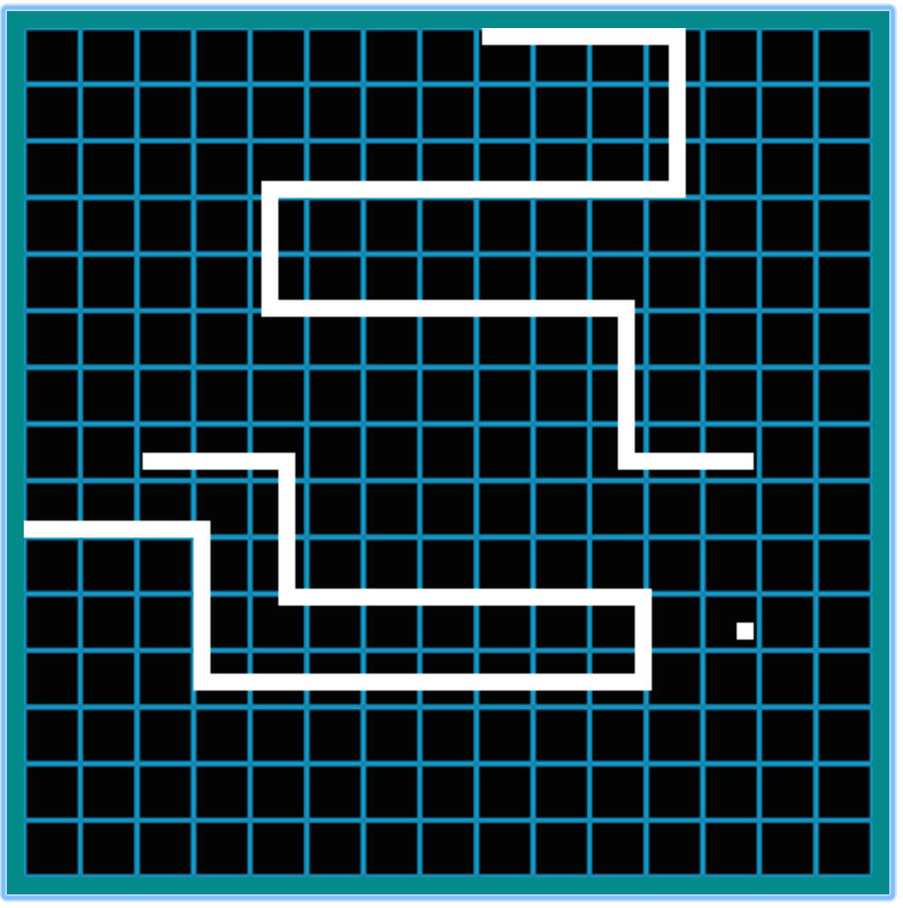

# Snake Tron

Authors: Hector Huertas & Marlo Major

[Play online](https://ideabox-hector.herokuapp.com/)

## Overview

Snake Tron is a Snake & Tron crossover where players race to collect points without crashing into the other player. It is build with JavaScript using Dream Driven Development.

## Screenshot

## Instructions

* Player One Controls: WASD

* Player Two Controls: Arrow Keys

* Collecting 'fruits' awards 1000 points each

* Dying subtracts 2500 points

## Deployment & Testing

To install the dependencies: `$ npm install `

To fire up a development server: `$ npm start`

Once the server is running, you can visit:

* `http://localhost:8080/webpack-dev-server/` to run your application.
* `http://localhost:8080/webpack-dev-server/test.html` to run your test suite in the browser.

To build the static files: `$ npm run build `

To run tests in Node: `$ npm test `
